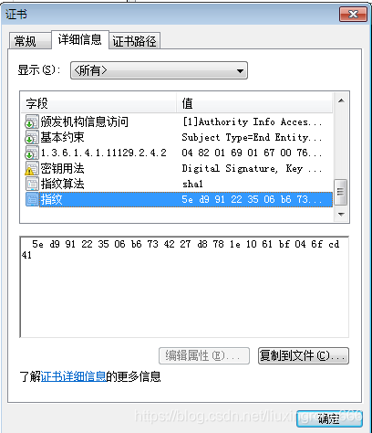

# 浏览器验证 HTTPS 流程

## 数字证书和 CA 机构

在说校验数字证书是否可信的过程前，我们先来看看数字证书是什么，一个数字证书通常包含了：

- 公钥；
- 持有者信息；
- 证书认证机构（CA）的信息；
- CA 对这份文件的数字签名及使用的算法；
- 证书有效期；
- 还有一些其他额外信息；

那数字证书的作用，是用来认证公钥持有者的身份，以防止第三方进行冒充。说简单些，证书就是用来告诉客户端，该服务端是否是合法的，因为只有证书合法，才代表服务端身份是可信的。

我们用证书来认证公钥持有者的身份（服务端的身份），那证书又是怎么来的？又该怎么认证证书呢？为了让服务端的公钥被大家信任，服务端的证书都是由 CA （Certificate Authority，证书认证机构）签名的，CA 就是网络世界里的公安局、公证中心，具有极高的可信度，所以由它来给各个公钥签名，信任的一方签发的证书，那必然证书也是被信任的。

之所以要签名，是因为签名的作用可以避免中间人在获取证书时对证书内容的篡改。

## 数字证书签发和验证流程

如下图图所示，为数字证书签发和验证流程：

CA 签发证书的过程，如上图左边部分：

1. 首先 CA 会把持有者的公钥、用途、颁发者、有效时间等信息打成一个包，
2. 然后对这些信息进行 Hash 计算，得到一个 Hash 值；
3. 接着 CA 会使用自己的私钥将该 Hash 值加密，生成 Certificate Signature，也就是 CA 对证书做了签名；
4. 最后将 Certificate Signature 添加在文件证书上，形成数字证书；

客户端校验服务端的数字证书的过程，如上图右边部分：

1. 首先客户端会使用同样的 Hash 算法获取该证书的 Hash 值 H1；
2. 通常浏览器和操作系统中集成了 CA 的公钥信息，浏览器收到证书后可以使用 CA 的公钥解密 Certificate Signature 内容，得到一个 Hash 值 H2 ；
3. 最后比较 H1 和 H2，如果值相同，则为可信赖的证书，否则则认为证书不可信。

## 证书链

但事实上，证书的验证过程中还存在一个证书信任链的问题，因为我们向 CA 申请的证书一般不是根证书签发的，而是由中间证书签发的，比如百度的证书，从下图你可以看到，证书的层级有三级：

对于这种三级层级关系的证书的验证过程如下：

1. 客户端收到 http://baidu.com 的证书后，发现这个证书的签发者不是根证书，就无法根据本地已有的根证书中的公钥去验证 http://baidu.com 证书是否可信。于是，客户端根据 http://baidu.com 证书中的签发者，找到该证书的颁发机构是 “GlobalSign Organization Validation CA - SHA256 - G2”，然后向 CA 请求该中间证书。
2. 请求到证书后发现 “GlobalSign Organization Validation CA - SHA256 - G2” 证书是由 “GlobalSign Root CA” 签发的，由于 “GlobalSign Root CA” 没有再上级签发机构，说明它是根证书，也就是自签证书。应用软件会检查此证书有否已预载于根证书清单上，如果有，则可以利用根证书中的公钥去验证 “GlobalSign Organization Validation CA - SHA256 - G2” 证书，如果发现验证通过，就认为该中间证书是可信的。
3. “GlobalSign Organization Validation CA - SHA256 - G2” 证书被信任后，可以使用 “GlobalSign Organization Validation CA - SHA256 - G2” 证书中的公钥去验证 http://baidu.com 证书的可信性，如果验证通过，就可以信任 http://baidu.com 证书。

这样的一层层地验证就构成了一条信任链路，整个证书信任链验证流程如下图所示：

## 证书具体形式

  

## 证书的指纹和签名

在解析数字证书的验证之前，先来解析一下什么是指纹和数字签名？

在上面的CSDN的证书中可以看到有一个叫指纹的字符串，指纹可以理解为证书身份的唯一代表，是用来保证证书的完整性的，确保证书没有被修改过。证书在发布之前，CA机构对证书的内容用指纹算法（一般是sha1或sha256）计算得到一个hash值，这个hash值就是指纹。为什么用hash值作为证书的身份代表呢？首先，hash值具有不可逆性，也就是说无法通过hash值得出原来的信息内容；其次，hash值具有唯一性，即hash计算可以保证不同的内容一定得到不同的hash值。

签名是在信息后面加上的一段数字串，可以证明该信息有没有被修改过。数字证书在发布的时候，CA机构将证书的指纹和指纹算法通过自己的私钥加密得到的就是证书的签名了。

先简单阐述一下证书的指纹和签名的作用，我们在验证证书的时候，首先通过机构的根公钥去解密证书的签名，解密成功的话会得到证书的指纹和指纹算法，指纹是一个hash值，它代表着证书的原始内容，此时再通过指纹算法计算证书内容得到另外一个hash值，如果这两个hash值相同，则代表证书没有被篡改过，否则就是被篡改了。

## HTTPS的数字证书验证过程

假设这是一个浏览器的HTTPS请求:

一. 首先浏览器通过URL网址去请求某个后台服务器，后台接收到请求后，就会给浏览器发送一个自己的CA数字证书。

二. 浏览器接收到数字证书以后，就要开始进行验证工作了。

1. 首先从证书的内容中获取证书的颁发机构。
2. 然后从浏览器系统中去寻找此颁发机构是否为浏览器的信任机构。这里解释一下，世界上就几个权威的CA机构，这几个机构的信息都是预先嵌入到我们的浏览器系统中的。如果收到的一个数字证书但其颁发机构没有在我们浏览器系统中的，那么就会有警告提示无法确认证书的真假。
3. 如果我们找到了证书颁发机构的根证书，那么就从根证书中取得那个根公钥，用根公钥去解密此证书的数字签名，成功解密的话就得到证书的指纹和指纹算法，指纹是证书内容通过指纹算法计算得到的一个hash值，这里我们称之为h1，h1代表证书的原始内容；然后用指纹算法对当前接收到的证书内容再进行一次hash计算得到另一个值h2，h2则代表当前证书的内容，如果此时h1和h2是相等的，就代表证书没有被修改过。如果证书被篡改过，h2和h1是不可能相同的，因为hash值具有唯一性，不同内容通过hash计算得到的值是不可能相同的。

有人说假如证书上的指纹是不法分子伪造的，伪造是没有用的，因为你伪造的指纹不可能用CA机构的根私钥去加密（根私钥是CA机构绝对保密的），伪造者只能拿自己的秘钥去加密这个伪造的指纹，但当我们拿机构的根公钥去解密伪造指纹的时候是不可能成功的（加密内容只能由一对公钥私钥解密）

在证书没有被修改过的基础上，再检查证书上的使用者的URL（比如csdn.net）和我们请求的URL是否相等，如果相等，那么就可以证明当前浏览器链接的网址也是正确的，而不是一些钓鱼网之类的

但如果浏览器的连接被某个中间人截取了，中间人也可以发一个由权威的CA机构颁发的证书给浏览器，然后也可以通过证书没有被篡改的验证，但是在证书没有被篡改的前提下，通过对比证书上的URL和我们请求的URL是否相同，我们还是可以判断当前证书是不是服务器发的证书。可以这么理解，因为URL具有唯一性，所以中间人的证书的上的URL和我们的证书的URL是不可能相同的，如果中间人修改了自己证书上的URL，那么就通过不了证书没有被篡改的验证，所以中间人的证书也是欺骗不了我们的

到这里我们认证了三点信息：

1. 证书是否为受信任的权威机构颁发的

2. 证书是否被篡改

3. 证书是否为服务器发过来的，而不是第三方发的

三. 到这里，已经验证了证书是没有被篡改的并且确认连接的URL也是正确的，然后我们获取到了证书上的公钥。下一步有一个很重要的任务就是，如何将一个对称加密算法的秘钥安全地发给服务器。
首先随机生成一个字符串S作为我们的秘钥，然后通过证书公钥加密成密文，将密文发送给服务器。因为此密文是用公钥加密的，这是一个非对称加密，我们知道，这个密文只有私钥的持有者才能进行解密，所以说任何第三方截取到密文也是没用的，因为没有对应的私钥所以解析不出来。

一个关键步骤，发送密文的时候也会对消息内容进行签名操作。签名上面讲解过，就是对密文内容进行hash计算得到的hash值再通过公钥或私钥加密得到的一段数字串，这个签名和消息内容一起发送出去。接收方收到消息以后，通过私钥或公钥解析出密文和签名的hash值，同时也会对接收的消息内容进行同样的hash计算得到另一个hash值，比对两个hash值是否相同来判断消息有没有被篡改过

四. 通过了上面的步骤以后，此时客户端和服务端都持有了对称加密算法的秘钥，然后客户端和服务端就可以愉快地安全通信了。

总结：数字证书的验证有两个重要的步骤，第一是验证数字证书没有被篡改以及连接的URL是否正确，第二是通过RSA机制的原理安全地将对称加密算法的秘钥发送给对方。这两步都完成以后，整个HTTPS的数字证书的验证就算是成功了。
